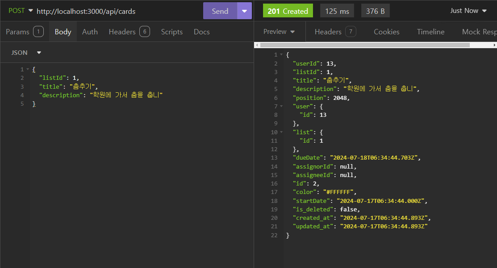
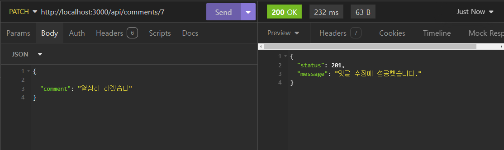

# 🖥️ The First Class 조의 Nest.js 트렐로(Trello) 프로젝트

## 프로젝트 소개

- 프로젝트 이름 : 트렐로(Trello) 프로젝트
- 내용 : Nest.js를 이용한 프로젝트 협업 도구 서비스 제작
- 구분 : 팀 프로젝트
- GitHub : https://github.com/komiharuu/Trello_Project
- 시연 영상 : https://www.youtube.com/watch?v=7SB6nWZrqjE
- 배포 : https://mymycode.shop/api/...  (Swagger는 각각 적용 못함)

 

## 팀원 구성

- 팀장 : 안지윤 [@komiharuu](https://github.com/komiharuu)
- 부팀장 : 김정찬 [@jkc-mycode](https://github.com/jkc-mycode)
- 팀원 : 박서진 [@Parkseojin2](https://github.com/Parkseojin2)
- 팀원 : 이수빈 [@soobeen0301](https://github.com/soobeen0301)
- 팀원 : 문병조 [@AYAAKIASA](https://github.com/AYAAKIASA)

 

## 1. 개발 기간

- 2024.07.11 ~ 2024.07.17

 

## 2. 개발 환경

- 운영체제 : Window/Mac
- FrontEnd : X
- BackEnd : TypeScript, Nest.js, MySQL(TypeORM)
- Tool : Visual Studio Code, Insomnia, DBeaver
- Publish : PM2, AWS/RDS, AWS/EC2, AWS/Load Balancer

 

## 3. 역할 분배

- **안지윤**
  - 카드 관련 CRUD 구현
  - 카드 이동 로직 구현
  - 카드 댓글 생성, 수정, 삭제 구현
  - 발표 진행
- **김정찬**
  - 회원가입, 로그인/로그아웃, 토큰 재발급 구현
  - 사용자 프로필 조회, 수정, 삭제 구현
  - 각 기능별 테스트 코드 작성 (미완성)
  - Readme 작성
  - 서비스 배포
- **박서진**
  - 리스트 관련 CRUD 구현
  - 리스트 이동 로직 구현
  - 시연 영상 제작
- **이수빈**
  - 보드 관련 CRUD 구현
  - 보드 사용자 초대 기능 구현
  - 사용자 초대 수락, 거절 기능 구현
  - 발표 PPT 제작
- **문병조**
  - 회원가입, 로그인/로그아웃, 토큰 재발급 구현
  - 사용자 프로필 조회, 수정, 삭제 구현
  - CI/CD 설정

 

## 4. API 명세서 및 ERD, 와이어 프레임

- API 명세서 : https://west-territory-778.notion.site/API-b11453591774408e94d6d67e0a466901?pvs=4

- ERD : https://www.erdcloud.com/d/bpC2oMvg3F3LvA4bE

- 와이어프레임 : https://www.figma.com/board/EjLbjpXmBcWE1Air58DnSR/Trello_Project?node-id=0-1&t=QB6TSAlNQ7nnxc28-0

 

## 5. 주요 기능 및 설명
### 5-1. 사용자 회원가입 API
#### 5-1-1. 회원가입 Controller
- 회원가입 DTO를 통해서 사용자의 입력값을 가져옵니다.

- https://github.com/komiharuu/Trello_Project/blob/6f8d6a1f37705ebf0ff54171aac6f5b146c4e0bb/src/auth/auth.controller.ts#L11-L14

#### 5-1-2. 회원가입 Service
- 비밀번호와 비밀번호 확인이 같은지 확인합니다.

- 이메일과 닉네임을 유니크한 값이기 때문에 중복을 체크합니다.

- 입력받은 비밀번호를 암호화해서 데이터베이스에 저장합니다.

- https://github.com/komiharuu/Trello_Project/blob/6f8d6a1f37705ebf0ff54171aac6f5b146c4e0bb/src/auth/auth.service.ts#L24-L53

 

 

### 5-2. 로그인 API
#### 5-2-1. 로그인 Controller
- `AuthGuard('local')`를 통해서 사용자의 입력이 유효한지 확인합니다.

- 유효하면 `req.user`에 들어있는 `id`값을 서비스에 넘깁니다.

- https://github.com/komiharuu/Trello_Project/blob/6f8d6a1f37705ebf0ff54171aac6f5b146c4e0bb/src/auth/auth.controller.ts#L16-L20

#### 5-2-2. 로그인 Service
- 컨트롤러로부터 받아온 사용자 `id`를 가지고 `Access Token`과 `Refresh Token`를 발급합니다.

- `Refresh Token`은 DB에서 관리하기 위해서 DB에 저장합니다.

- https://github.com/komiharuu/Trello_Project/blob/6f8d6a1f37705ebf0ff54171aac6f5b146c4e0bb/src/auth/auth.service.ts#L72-L89

 

 

### 5-3. 로그아웃 API
#### 5-3-1. 로그아웃 Controller
- `RefreshTokenGuard`를 통해서 헤더에 있는 `Refresh Token`이 유효한지 확인합니다.

- 유효하면 `req.user`에 들어있는 `id`값을 서비스에 넘깁니다.

- https://github.com/komiharuu/Trello_Project/blob/6f8d6a1f37705ebf0ff54171aac6f5b146c4e0bb/src/auth/auth.controller.ts#L22-L26

#### 5-3-2. 로그아웃 Service
- 컨트롤러로부터 받아온 `userId`로 이미 로그아웃한 사용자인지 확인합니다.

- `Refresh Token`의 유무를 통해 확인이 가능합니다.

- https://github.com/komiharuu/Trello_Project/blob/6f8d6a1f37705ebf0ff54171aac6f5b146c4e0bb/src/auth/auth.service.ts#L91-L107

 

 

### 5-4. 토큰 재발급 API
#### 5-4-1. 토큰 재발급 Controller
- `RefreshTokenGuard`를 통해서 헤더에 있는 `Refresh Token`이 유효한지 확인합니다.

- 유효하면 `req.user`에 들어있는 `id`값을 서비스에 넘깁니다.

- https://github.com/komiharuu/Trello_Project/blob/6f8d6a1f37705ebf0ff54171aac6f5b146c4e0bb/src/auth/auth.controller.ts#L28-L32

#### 5-4-2. 토큰 재발급 Service
- 로그인과 똑같이 `Access Token`과 `Refresh Token`를 발급합니다.

- `Refresh Token`은 데이터베이스에 저장합니다.

- https://github.com/komiharuu/Trello_Project/blob/6f8d6a1f37705ebf0ff54171aac6f5b146c4e0bb/src/auth/auth.service.ts#L109-L125

 

 

### 5-5. 사용자 프로필 조회 API
#### 5-5-1. 사용자 프로필 조회 Controller
- 전역에 설정한 `AuthGuard('jwt')`를 통해서 사용자의 토큰이 유효한지 확인합니다.

- 유효하다면 `req.user`를 통해 사용자 `id`를 서비스에 넘깁니다.

- https://github.com/komiharuu/Trello_Project/blob/6f8d6a1f37705ebf0ff54171aac6f5b146c4e0bb/src/users/users.controller.ts#L11-L15

#### 5-5-2. 사용자 프로필 조회 Service
- 컨트롤러로부터 받아온 사용자 `id`를 통해서 사용자가 탈퇴한 사용자인지 확인합니다.

- 확인되었다면 출력 형식에 맞게 객체를 반환합니다.

- https://github.com/komiharuu/Trello_Project/blob/6f8d6a1f37705ebf0ff54171aac6f5b146c4e0bb/src/users/users.service.ts#L31-L45

 

 

### 5-6. 사용자 프로필 수정 API
#### 5-6-1. 사용자 프로필 수정 Controller
- 사용자 프로필 수정 DTO를 통해서 사용자의 입력값을 가져옵니다.

- 전역에 설정한 `AuthGuard('jwt')`를 통해서 `req.user` 데이터를 가져옵니다.

- `req.user`를 통해서 사용자 `id`를 서비스로 넘깁니다.

- https://github.com/komiharuu/Trello_Project/blob/6f8d6a1f37705ebf0ff54171aac6f5b146c4e0bb/src/users/users.controller.ts#L17-L21

#### 5-6-2. 사용자 프로필 수정 Service
- 컨트롤러로부터 받아온 `nickname`가 입력되었는지 확인합니다.

- 수정될 `nickname`이 있다면 데이터베이스에서 중복을 체크합니다.

- https://github.com/komiharuu/Trello_Project/blob/6f8d6a1f37705ebf0ff54171aac6f5b146c4e0bb/src/users/users.service.ts#L88-L111

 

 

### 5-7. 사용자 프로필 삭제(회원탈퇴) API
#### 5-7-1. 사용자 프로필 삭제 Controller
- 사용자 프로필 삭제, 즉 회원 탈퇴를 의미합니다.

- 전역에 설정한 `AuthGuard('jwt')`를 통해서 `req.user` 데이터를 가져옵니다.

- `req.user`를 통해서 사용자 `id`를 서비스로 넘깁니다.

- https://github.com/komiharuu/Trello_Project/blob/6f8d6a1f37705ebf0ff54171aac6f5b146c4e0bb/src/users/users.controller.ts#L23-L27

#### 5-7-2. 사용자 프로필 삭제 Service
- `Soft Delete`를 통한 탈퇴 처리를 할 것이기 때문에 사용자 데이터베이스에서 `is_delete` 컬럼의 값을 `true`로 변경합니다.

- https://github.com/komiharuu/Trello_Project/blob/6f8d6a1f37705ebf0ff54171aac6f5b146c4e0bb/src/users/users.service.ts#L113-L120

 

 

### 5-8. 보드 생성 API
#### 5-8-1. 보드 생성 Controller
- 사용자가 가입한 사용자인지를 파악하기 위해서 `AuthGuard('jwt')`를 사용합니다.

- 보드 생성 DTO를 통해서 사용자의 입력값을 가져와 서비스로 넘깁니다.

- https://github.com/komiharuu/Trello_Project/blob/6f8d6a1f37705ebf0ff54171aac6f5b146c4e0bb/src/boards/boards.controller.ts#L28-L37

#### 5-8-2. 보드 생성 Service
- 컨트롤러로부터 받아온 데이터를 통해서 새로운 보드를 생성합니다.

- https://github.com/komiharuu/Trello_Project/blob/6f8d6a1f37705ebf0ff54171aac6f5b146c4e0bb/src/boards/boards.service.ts#L19-L52

 

 

### 5-9. 보드 목록 조회 API
#### 5-9-1. 보드 목록 조회 Controller
- 사용자가 가입한 사용자인지를 파악하기 위해서 `AuthGuard('jwt')`를 사용합니다.

- `BoardMemberGuard`를 통해 로그인한 사용자가 현재 보드의 오너이거나 멤버인지 확인합니다.

- https://github.com/komiharuu/Trello_Project/blob/6f8d6a1f37705ebf0ff54171aac6f5b146c4e0bb/src/boards/boards.controller.ts#L39-L48

#### 5-9-2. 보드 목록 조회 Service
- 조회 기능은 가장 많이 사용되기 때문에 데이터 캐싱을 활용합니다.

- 캐싱된 데이터가 있다면 바로 컨트롤러에 데이터를 반환합니다.

- 없다면 데이터베이스에서 직접 오너인지, 보드에 속한 멤버인지 확인합니다.

- 직접 조회가 끝나면 다음을 위해서 데이터를 캐싱합니다.

- https://github.com/komiharuu/Trello_Project/blob/6f8d6a1f37705ebf0ff54171aac6f5b146c4e0bb/src/boards/boards.service.ts#L54-L99

 

 

### 5-10. 보드 상세 조회 API
#### 5-10-1. 보드 상세 조회 Controller
- 사용자가 가입한 사용자인지를 파악하기 위해서 `AuthGuard('jwt')`를 사용합니다.

- `BoardMemberGuard`를 통해 로그인한 사용자가 현재 보드의 오너이거나 멤버인지 확인합니다.

- 보드 상세 조회이기 때문에 `@Param()`를 통해서 `Path Parameter`값을 가져와서 서비스에 넘깁니다.

- https://github.com/komiharuu/Trello_Project/blob/6f8d6a1f37705ebf0ff54171aac6f5b146c4e0bb/src/boards/boards.controller.ts#L50-L59

#### 5-10-2. 보드 상세 조회 Service
- 컨트롤러로부터 받아온 `boardId`값으로 존재하는 보드인지 확인합니다.

- 존재하는 보드라면 출력 형식에 맞춰서 컨트롤러로 반환합니다.

- https://github.com/komiharuu/Trello_Project/blob/6f8d6a1f37705ebf0ff54171aac6f5b146c4e0bb/src/boards/boards.service.ts#L101-L126

 

 

### 5-11. 보드 수정 API
#### 5-11-1. 보드 수정 Controller
- 사용자가 가입한 사용자인지를 파악하기 위해서 `AuthGuard('jwt')`를 사용합니다.

- `BoardMemberGuard`를 통해 로그인한 사용자가 현재 보드의 오너이거나 멤버인지 확인합니다.

- 보드 수정 DTO를 통해서 사용자의 입력값을 가져옵니다.

- 그리고 특정 보드를 수정하기 위해서 `@Param()`를 통해서 `boardId`를 가져옵니다.

- https://github.com/komiharuu/Trello_Project/blob/6f8d6a1f37705ebf0ff54171aac6f5b146c4e0bb/src/boards/boards.controller.ts#L61-L74

#### 5-11-2. 보드 수정 Service
- 컨트롤러로부터 받아온 `boardId`를 통해서 해당 보드가 존재하는지 확인합니다.

- 그리고 입력된 내용만 바꿔주기 위한 조건문을 사용하고 변경된 데이터를 저장합니다.

- https://github.com/komiharuu/Trello_Project/blob/6f8d6a1f37705ebf0ff54171aac6f5b146c4e0bb/src/boards/boards.service.ts#L128-L160

 

 

### 5-12. 보드 삭제 API
#### 5-12-1. 보드 삭제 Controller
- 사용자가 가입한 사용자인지를 파악하기 위해서 `AuthGuard('jwt')`를 사용합니다.

- `BoardMemberGuard`를 통해 로그인한 사용자가 현재 보드의 오너이거나 멤버인지 확인합니다.

- 그리고 특정 보드를 삭제하기 위해서 `@Param()`를 통해서 `boardId`를 가져옵니다.

- https://github.com/komiharuu/Trello_Project/blob/6f8d6a1f37705ebf0ff54171aac6f5b146c4e0bb/src/boards/boards.controller.ts#L76-L85

#### 5-12-2. 보드 삭제 Service
- 컨트롤러로부터 받아온 `boardId`를 통해서 해당 보드가 존재하는지 확인합니다.

- `Soft Delete`를 하기 위해서 보드 테이블의 `is_deleted` 컬럼의 값을 `true`로 수정합니다.

- https://github.com/komiharuu/Trello_Project/blob/6f8d6a1f37705ebf0ff54171aac6f5b146c4e0bb/src/boards/boards.service.ts#L162-L181

 

 

### 5-13. 보드 초대 API
#### 5-13-1. 보드 초대 Controller
- 사용자가 가입한 사용자인지를 파악하기 위해서 `AuthGuard('jwt')`를 사용합니다.

- `BoardOwnerGuard`를 통해 로그인한 사용자가 현재 보드의 오너인지 확인합니다.

- 특정 보드의 대한 초대를 하기 위해서 `@Param()`를 통해 `boardId`를 받아옵니다.

- 초대를 보내기 위한 DTO를 통해 오너의 입렵값을 가져와 서비스로 넘깁니다.

- https://github.com/komiharuu/Trello_Project/blob/6f8d6a1f37705ebf0ff54171aac6f5b146c4e0bb/src/invitations/invitations.controller.ts#L24-L37

#### 5-13-2. 보드 초대 Service
- 컨트롤러로부터 받아온 `boardId`를 통해서 실제 보드가 존재하는지 확인합니다.

- 그리고 초대 보내는 사용자도 존재하는지 확인합니다.

- 만약 이미 멤버라면 예외 처리에 대한 메세지를 반환합니다.

- 모든 예외 처리를 통과하면 `Nodemailer`를 통해서 사용자에게 토큰을 전송합니다.

- https://github.com/komiharuu/Trello_Project/blob/6f8d6a1f37705ebf0ff54171aac6f5b146c4e0bb/src/invitations/invitations.service.ts#L58-L131

 

 

### 5-14. 보드 초대 수락 API
#### 5-14-1. 보드 초대 수락 Controller
- 일반 사용자가 보드 오너의 초대를 수락하기 위한 API입니다.

- 사용자가 가입한 사용자인지를 파악하기 위해서 `AuthGuard('jwt')`를 사용합니다.

- 사용자가 받은 토큰을 확인하기 위해서 `@Query()`를 통해 `token`를 받아옵니다.

- https://github.com/komiharuu/Trello_Project/blob/6f8d6a1f37705ebf0ff54171aac6f5b146c4e0bb/src/invitations/invitations.controller.ts#L39-L48

#### 5-14-2. 보드 초대 수락 Service
- 컨트롤러로부터 받아온 사용자의 이메일 토큰을 정말 해당 보드에서 전송한 토큰인지 확인합니다.

- 그리고 만약 이미 멤버라면 예외 처리에 대한 메세지를 반환합니다.

- 새로운 멤버라면 그 사용자를 새로운 보드 멤버로 추가합니다.

- 그리고 초대가 끝났기 때문에 `invitations` 테이블에서의 초대 상태를 `Accept`로 변경합니다.

- https://github.com/komiharuu/Trello_Project/blob/6f8d6a1f37705ebf0ff54171aac6f5b146c4e0bb/src/invitations/invitations.service.ts#L132-L167

 

 

### 5-15. 보드 초대 거절 API
#### 5-15-1. 보드 초대 거절 Controller
- 일반 사용자가 보드 오너의 초대를 거절하기 위한 API입니다.

- 사용자가 가입한 사용자인지를 파악하기 위해서 `AuthGuard('jwt')`를 사용합니다.

- 사용자가 받은 토큰을 확인하기 위해서 `@Query()`를 통해 `token`를 받아옵니다.

- https://github.com/komiharuu/Trello_Project/blob/6f8d6a1f37705ebf0ff54171aac6f5b146c4e0bb/src/invitations/invitations.controller.ts#L50-L59

#### 5-15-2. 보드 초대 거절 Service
- 초대 수락 로직과 똑같이 해당 보드에서 전송한 토큰이 맞는지 확인합니다.

- 그리고 만약 이미 멤버라면 예외 처리에 대한 메세지를 반환합니다.

- 초대 거절이기 때문에 `invitations` 테이블에서의 초대 상태를 `Declined`로 변경합니다.

- https://github.com/komiharuu/Trello_Project/blob/6f8d6a1f37705ebf0ff54171aac6f5b146c4e0bb/src/invitations/invitations.service.ts#L169-L194

 

 

### 5-16. 리스트 생성 API
#### 5-16-1. 리스트 생성 Controller
- 전역에서 사용자가 가입한 사용자인지를 파악하기 위한 `AuthGuard('jwt')`를 사용합니다.

- 그리고 `BoardMemberGuard`를 통해 로그인한 사용자가 현재 보드의 오너이거나 멤버인지 확인합니다.

- 리스트 생성 DTO를 통해서 사용자의 입력값을 가져와 서비스에 넘깁니다.

- https://github.com/komiharuu/Trello_Project/blob/6f8d6a1f37705ebf0ff54171aac6f5b146c4e0bb/src/lists/lists.controller.ts#L27-L32

#### 5-16-2. 리스트 생성 Service
- 컨트롤러로부터 받아온 `userId`와 `boardId`를 통해서 존재하는 사용자, 보드인지 확인합니다.

- 그리고 만약에 데이터베이스에 리스트가 존재하지 않는다면 첫 리스트 데이터의 `position`값은 1024가 됩니다.

- 이미 리스트 데이터가 존재한다면 새로 만들어진 리스트의 `position`은 리스트 중 가장 큰 `position`에 `+ 1024`를 해줍니다.

- https://github.com/komiharuu/Trello_Project/blob/6f8d6a1f37705ebf0ff54171aac6f5b146c4e0bb/src/lists/lists.service.ts#L23-L69

 

 

### 5-17. 리스트 목록 조회 API
#### 5-17-1. 리스트 목록 조회 Controller
- 전역에서 사용자가 가입한 사용자인지를 파악하기 위한 `AuthGuard('jwt')`를 사용합니다.

- 그리고 `BoardMemberGuard`를 통해 로그인한 사용자가 현재 보드의 오너이거나 멤버인지 확인합니다.

- 특정 보드에 리스트를 추가 하기 위해서 `@Param()`를 통해 `boardId`를 받아옵니다.

- https://github.com/komiharuu/Trello_Project/blob/6f8d6a1f37705ebf0ff54171aac6f5b146c4e0bb/src/lists/lists.controller.ts#L34-L37

#### 5-17-2. 리스트 목록 조회 Service
- 컨트롤러로부터 받아온 `boardId`를 통해서 어떤 보드의 리스트인지 조회합니다.

- 그리고 출력 양식에 맞도록 해당 리스트 목록을 수정해서 반환합니다.

- https://github.com/komiharuu/Trello_Project/blob/6f8d6a1f37705ebf0ff54171aac6f5b146c4e0bb/src/lists/lists.service.ts#L95-L117

 

 

### 5-18. 리스트 수정 API
#### 5-18-1. 리스트 수정 Controller
- 전역에서 사용자가 가입한 사용자인지를 파악하기 위한 `AuthGuard('jwt')`를 사용합니다.

- 그리고 `BoardMemberGuard`를 통해 로그인한 사용자가 현재 보드의 오너이거나 멤버인지 확인합니다.

- 특정 리스트를 수정 하기 위해서 `@Param()`를 통해 `listId`를 받아옵니다.

- 그리고 리스트 수정 DTO를 통해서 사용자의 입력값을 받아와 서비스에 넘깁니다.

- https://github.com/komiharuu/Trello_Project/blob/6f8d6a1f37705ebf0ff54171aac6f5b146c4e0bb/src/lists/lists.controller.ts#L39-L42

#### 5-18-2. 리스트 수정 Service
- 컨트롤러로부터 받아온 `listId`로 실제 존재하는 리스트가 있는지 확인합니다.

- 만약 존재한다면 리스트 수정 DTO를 통해 받아온 데이터로 찾은 리스트를 수정합니다.

- https://github.com/komiharuu/Trello_Project/blob/6f8d6a1f37705ebf0ff54171aac6f5b146c4e0bb/src/lists/lists.service.ts#L71-L81

 

 

### 5-19. 리스트 삭제 API
#### 5-19-1. 리스트 삭제 Controller
- 전역에서 사용자가 가입한 사용자인지를 파악하기 위한 `AuthGuard('jwt')`를 사용합니다.

- 그리고 `BoardMemberGuard`를 통해 로그인한 사용자가 현재 보드의 오너이거나 멤버인지 확인합니다.

- 특정 리스트를 삭제 하기 위해서 `@Param()`를 통해 `listId`를 받아옵니다.

- https://github.com/komiharuu/Trello_Project/blob/6f8d6a1f37705ebf0ff54171aac6f5b146c4e0bb/src/lists/lists.controller.ts#L44-L47

#### 5-19-2. 리스트 삭제 Service
- 컨트롤러로부터 받아온 `listId`로 실제 존재하는 리스트가 있는지 확인합니다.

- `Soft Delete`를 위한 `isDeleted`가 있지만 실수로 `Hard Delete`로 구현했습니다.

- (추후에 수정될 예정입니다.)

- https://github.com/komiharuu/Trello_Project/blob/6f8d6a1f37705ebf0ff54171aac6f5b146c4e0bb/src/lists/lists.service.ts#L83-L93

 

 

### 5-20. 리스트 이동 API
#### 5-20-1. 리스트 이동 Controller
- 전역에서 사용자가 가입한 사용자인지를 파악하기 위한 `AuthGuard('jwt')`를 사용합니다.

- 그리고 `BoardMemberGuard`를 통해 로그인한 사용자가 현재 보드의 오너이거나 멤버인지 확인합니다.

- 특정 리스트를 이동시키기 위해서 `@Param()`를 통해 `listId`를 받아옵니다.

- 그리고 리스트 이동 DTO를 통해서 사용자의 입력값을 서비스로 넘깁니다.

- 리스트 이동 DTO에는 이동할 위치의 앞 리스트 `position`과 뒤 리스트  `position`를 입력합니다.

- https://github.com/komiharuu/Trello_Project/blob/6f8d6a1f37705ebf0ff54171aac6f5b146c4e0bb/src/lists/lists.controller.ts#L49-L55

#### 5-20-2. 리스트 이동 Service
- 가장 앞, 가장 뒤로 리스트를 이동할 경우에는 `null`값 입력을 통해서 위치를 계산합니다.

- 코드에서는 `null`과 `undefined`가 동일하게 동작합니다.

- 위치 계산이 끝나면 해당 리스트가 존재하는지 확인하고 `position` 수정 후 데이터베이스에 저장합니다.

- 만약에 중간값의 차이가 1보다 작거나 같을 경우에는 카드를 정렬시키고 `position`를 재설정해 줍니다.

- 그리고 반환할 때는 리스트의 포지션 순으로 컨트롤러에 반환합니다.

- https://github.com/komiharuu/Trello_Project/blob/6f8d6a1f37705ebf0ff54171aac6f5b146c4e0bb/src/lists/lists.service.ts#L120-L163

 

 

### 5-21. 카드 생성 API
#### 5-21-1. 카드 생성 Controller
- 전역에서 사용자가 가입한 사용자인지를 파악하기 위한 `AuthGuard('jwt')`를 사용합니다.

- 그리고 `BoardMemberGuard`를 통해 로그인한 사용자가 현재 보드의 오너이거나 멤버인지 확인합니다.

- 카드 생성 DTO를 통해서 사용자의 입력값을 가져와서 서비스로 넘깁니다.

- https://github.com/komiharuu/Trello_Project/blob/6f8d6a1f37705ebf0ff54171aac6f5b146c4e0bb/src/cards/cards.controller.ts#L28-L33

#### 5-21-2. 카드 생성 Service
- 컨트롤러로부터 받아온 `listId`를 통해서 카드를 넣을 리스트가 존재하는지 확인합니다.

- 처음 만들어진 카드라면 `position`의 값을 `1024`로 설정합니다.

- 만약 이미 카드 데이터가 존재한다면 `position`값을 `최대 position + 1024`로 설정합니다.

- 받아온 데이터와 계산된 `position`를 통해서 카드를 생성하고 데이터베이스에 저장합니다.

- https://github.com/komiharuu/Trello_Project/blob/6f8d6a1f37705ebf0ff54171aac6f5b146c4e0bb/src/cards/cards.service.ts#L24-L56

 

 

### 5-22. 카드 상세 조회 API
#### 5-22-1. 카드 상세 조회 Controller
- 전역에서 사용자가 가입한 사용자인지를 파악하기 위한 `AuthGuard('jwt')`를 사용합니다.

- 그리고 `BoardMemberGuard`를 통해 로그인한 사용자가 현재 보드의 오너이거나 멤버인지 확인합니다.

- 특정 카드를 조회하기 위해서  `@Param()`를 통해 `cardId`를 받아옵니다.

- https://github.com/komiharuu/Trello_Project/blob/6f8d6a1f37705ebf0ff54171aac6f5b146c4e0bb/src/cards/cards.controller.ts#L35-L39

#### 5-22-2. 카드 상세 조회 Service
- 컨트롤러로부터 받아온 `cardId`를 통해서 존재하는 카드인지 확인합니다.

- 그리고 그 카드에 추가된 댓글까지 같이 반환하기 위해서 `relation`에 `comments`를 넣어서 관계를 보여줍니다.

- https://github.com/komiharuu/Trello_Project/blob/6f8d6a1f37705ebf0ff54171aac6f5b146c4e0bb/src/cards/cards.service.ts#L58-L68

 

 

### 5-23. 카드 수정 API
#### 5-23-1. 카드 수정 Controller
- 전역에서 사용자가 가입한 사용자인지를 파악하기 위한 `AuthGuard('jwt')`를 사용합니다.

- 그리고 `BoardMemberGuard`를 통해 로그인한 사용자가 현재 보드의 오너이거나 멤버인지 확인합니다.

- 특정 카드를 수정하기 위해서  `@Param()`를 통해 `cardId`를 받아옵니다.

- 카드 수정 DTO를 통해서 사용자의 입력값을 받아서 서비스에 넘깁니다.

- https://github.com/komiharuu/Trello_Project/blob/6f8d6a1f37705ebf0ff54171aac6f5b146c4e0bb/src/cards/cards.controller.ts#L41-L49

#### 5-23-2. 카드 수정 Service
- 컨트롤러로부터 받아온 `cardId`를 통해서 실제 존재하는 카드인지 확인합니다.

- 해당하는 카드가 있다면 카드 수정 DTO 값들을 통해 카드를 수정하고 저장합니다.

- https://github.com/komiharuu/Trello_Project/blob/6f8d6a1f37705ebf0ff54171aac6f5b146c4e0bb/src/cards/cards.service.ts#L70-L92

 

 

### 5-24. 카드 삭제 API
#### 5-24-1. 카드 삭제 Controller
- 전역에서 사용자가 가입한 사용자인지를 파악하기 위한 `AuthGuard('jwt')`를 사용합니다.

- 그리고 `BoardMemberGuard`를 통해 로그인한 사용자가 현재 보드의 오너이거나 멤버인지 확인합니다.

- 특정 카드를 삭제하기 위해서  `@Param()`를 통해 `cardId`를 받아옵니다.

- https://github.com/komiharuu/Trello_Project/blob/6f8d6a1f37705ebf0ff54171aac6f5b146c4e0bb/src/cards/cards.controller.ts#L63-L68

#### 5-24-2. 카드 삭제 Service
- 컨트롤러로부터 받아온 `cardId`를 통해서 실제 존재하는 카드인지 확인합니다.

- `Soft Delete`를 위한 `isDeleted`가 있지만 실수로 `Hard Delete`로 구현했습니다.

- (추후에 수정될 예정입니다.)

- https://github.com/komiharuu/Trello_Project/blob/6f8d6a1f37705ebf0ff54171aac6f5b146c4e0bb/src/cards/cards.service.ts#L94-L101

 

 

### 5-25. 카드 이동 API
#### 5-25-1. 카드 이동 Controller
- 전역에서 사용자가 가입한 사용자인지를 파악하기 위한 `AuthGuard('jwt')`를 사용합니다.

- 그리고 `BoardMemberGuard`를 통해 로그인한 사용자가 현재 보드의 오너이거나 멤버인지 확인합니다.

- 특정 카드를 이동시키기 위해서  `@Param()`를 통해 `cardId`를 받아옵니다.

- https://github.com/komiharuu/Trello_Project/blob/6f8d6a1f37705ebf0ff54171aac6f5b146c4e0bb/src/cards/cards.controller.ts#L51-L55

#### 5-25-2. 카드 이동 Service
- 리스트 이동과 마찬가지로 가장 앞, 가장 뒤로 카드를 이동할 경우에는 `null`값 입력을 통해서 위치를 계산합니다.

- 위치 계산이 끝나면 해당 카드가 존재하는지 확인하고 `position` 수정 후 데이터베이스에 저장합니다.

- 만약에 중간값의 차이가 1보다 작거나 같을 경우에는 카드를 정렬시키고 `position`를 재설정해 줍니다.

- https://github.com/komiharuu/Trello_Project/blob/6f8d6a1f37705ebf0ff54171aac6f5b146c4e0bb/src/cards/cards.service.ts#L104-L145

 

 

### 5-26. 카드 작업자 할당 API
#### 5-26-1. 카드 작업자 할당 Controller
- 전역에서 사용자가 가입한 사용자인지를 파악하기 위한 `AuthGuard('jwt')`를 사용합니다.

- 그리고 `BoardMemberGuard`를 통해 로그인한 사용자가 현재 보드의 오너이거나 멤버인지 확인합니다.

- 특정 카드에 작업자를 할당시키기 위해서  `@Param()`를 통해 `cardId`를 받아옵니다.

- 작업자 할당 DTO를 통해서 사용자의 입력값을 서비스로 넘깁니다.

- 작업자 할당 DTO는 작업을 할당한 사람의 `userId`와 할당받은 사람의 `userId`를 입력합니다.

- https://github.com/komiharuu/Trello_Project/blob/6f8d6a1f37705ebf0ff54171aac6f5b146c4e0bb/src/cards/cards.controller.ts#L57-L61

#### 5-26-2. 카드 작업자 할당 Service
- 컨트롤러로부터 받아온 `cardId`를 통해서 실제 존재하는 카드인지 확인합니다.

- 그리고 `assignorId`와 `assigneeId`로 존재하는 사용자인지 확인합니다.

- (원래는 해당 보드 멤버로 존재하는지 확인해야 합니다.)

- 카드의 데이터에 접근해서 해당 할당자와 작업자 ID를 수정합니다.

- https://github.com/komiharuu/Trello_Project/blob/6f8d6a1f37705ebf0ff54171aac6f5b146c4e0bb/src/cards/cards.service.ts#L147-L176

 

 

### 5-27. 카드 댓글 작성 API
#### 5-27-1. 카드 댓글 작성 Controller
- 댓글 관련 기능들도 역시 전역에서 사용자가 가입한 사용자인지를 파악하기 위한 `AuthGuard('jwt')`를 사용합니다.

- 그리고 `BoardMemberGuard`를 통해 로그인한 사용자가 현재 보드의 오너이거나 멤버인지 확인합니다.

- 댓글 작성 DTO를 통해서 사용자의 입력값을 서비스로 넘깁니다.

- https://github.com/komiharuu/Trello_Project/blob/858be3074e2bb3e3f161bf9aebe3ff9992c46442/src/comments/comments.controller.ts#L26-L31

#### 5-27-2. 카드 댓글 작성 Service
- 컨트롤러로부터 받아온 댓글 작성 DTO를 통해서 해당 카드가 존재하는지 확인합니다.

- 해당 카드가 존재한다면 댓글 작성 DTO의 값을 데이터베이스에 저장합니다.

- https://github.com/komiharuu/Trello_Project/blob/858be3074e2bb3e3f161bf9aebe3ff9992c46442/src/comments/comments.service.ts#L20-L35

 

 

### 5-28. 카드 댓글 수정 API
#### 5-28-1. 카드 댓글 수정 Controller
- 전역에서 사용자가 가입한 사용자인지를 파악하기 위한 `AuthGuard('jwt')`를 사용합니다.

- 그리고 `BoardMemberGuard`를 통해 로그인한 사용자가 현재 보드의 오너이거나 멤버인지 확인합니다.

- 특정 댓글을 수정하기 위해서  `@Param()`를 통해 `commentId`를 받아옵니다.

- https://github.com/komiharuu/Trello_Project/blob/858be3074e2bb3e3f161bf9aebe3ff9992c46442/src/comments/comments.controller.ts#L33-L41

#### 5-28-2. 카드 댓글 수정 Service
- 컨트롤러로부터 받아온 `commentId`로 실제 존재하는 댓글인지 확인합니다.

- 만약 존재하는 댓글이라면 댓글 수정 DTO의 데이터를 통해서 댓글을 수정합니다.

- https://github.com/komiharuu/Trello_Project/blob/858be3074e2bb3e3f161bf9aebe3ff9992c46442/src/comments/comments.service.ts#L37-L52

 

 

### 5-29. 카드 댓글 삭제 API
#### 5-29-1. 카드 댓글 삭제 Controller
- 전역에서 사용자가 가입한 사용자인지를 파악하기 위한 `AuthGuard('jwt')`를 사용합니다.

- 그리고 `BoardMemberGuard`를 통해 로그인한 사용자가 현재 보드의 오너이거나 멤버인지 확인합니다.

- 특정 댓글을 삭제하기 위해서  `@Param()`를 통해 `commentId`를 받아옵니다.

- https://github.com/komiharuu/Trello_Project/blob/858be3074e2bb3e3f161bf9aebe3ff9992c46442/src/comments/comments.controller.ts#L43-L48

#### 5-29-2. 카드 댓글 삭제 Service
- 컨트롤러로부터 받아온 `commentId`로 실제 존재하는 댓글인지 확인합니다.

- 만약 존재하는 댓글이라면 해당 댓글을 `isDeleted`를 통해서 `Soft Delete`를 합니다.

- https://github.com/komiharuu/Trello_Project/blob/858be3074e2bb3e3f161bf9aebe3ff9992c46442/src/comments/comments.service.ts#L54-L65

 

 

## 6. 어려웠던 점 및 해결 방안

### 6-1. TypeORM 외래키를 다루는 방법 (안지윤)
- **어려웠던 점** : TypeORM 외래키를 다루는 방법이 어려웠다.

- **해결 방안** : 외래키 문제로 인해서 DB를 지우는 방법을 선택하였다.

 

### 6-2. 처음 활용해 보는 테스트 코드 (김정찬)
- **어려웠던 점** : 테스트 코드에 대해 공식문서와 블로그들을 봐도 감이 쉽게 잡히지 않았다. 대부분 테스트 코드의 형식이 나와 있고 어떤 기준을 가지고 테스트 코드를 짜야 하는지 나와있지 않다 보니 어디까지 테스트해야하고 어떤 부분을 테스트해야 하는 지 생각보다 많은 시간을 고민했다. 

- **해결 방안** : 확실한 해결 방안은 아니지만 튜터님의 피드백을 통해서 몇 가지 궁금증은 풀렸다. 일단 모든 로직을 테스트할려고 할 필요가 없고, 중요도를 통해서 로직의 우선순위를 생각해야 한다. 너무 매몰되면 그로 인한 사이드 이펙트가 생기기 때문에 자신만의 기준을 통해서 구현하는 게 중요하다. 그리고 가장 헷갈렸던 부분인 가드나 인터셉터에 대한 테스트 코드는 TDD에서 생각하지 않아도 된다고 하셨다. 마지막으로 엣지 케이스와 커먼 케이스를 생각해서 케이스에 대한 구멍이 없도록 테스트 하는 것이 중요하다.

 

### 6-3. 리스트 포지션 이동 (박서진)
- **어려웠던 점** : 이번 트렐로 프로젝트에서 리스트 부분을 작성하며 제일 어려웠던 부분은 포지션에 관한 부분이었습니다.

- **해결 방안** : 포지션 이동 API 코드 구현 후 겹침 방지나 정렬 방법등을 잘 구현해놓고 조회 메서드나 생성 API를 맞게 수정하지 않아 작성한 코드들의 기능들이 상쇄되는 경험을 했습니다.
따라서 생성 API에서는 행이 없는 경우와 하나 이상 있는 경우를 지정해 1024로 시작, 더해주는 식의 메서드를 구현, 조회 메서드에서는 오름차순으로 정렬 될 수 있는 `({order:{position: 'ASC'})` 를 사용하여 포지션 이동 API를 마무리 지을 수 있게 되었습니다.

 

### 6-4. 인가 기능 구현 - 가드 코드 작성 (이수빈)
- **어려웠던 점** : board정보를 가져오지 못해서 가드를 적용한 모든 기능이 작동하지 않는 문제 발생

- **해결 방안** : findOne메서드 where절에서 객체를 가져오는 방법이 잘못되어 생긴 문제
`findOne({ where: [{ id: boardId, user },{ id: boardId, members: user },]` -> `find({ where: [{ ownerId: user.id }, { members: { userId: user.id } }]`

 

### 6-5.  (문병조)
- **어려웠던 점** : 미리 저장해둔 코드를 그대로 복붙해서 사용하고 에러가 나면 구글링하다 그래도 안되면 chat gpt를 이용하다 보니 쓸데없는 코드랑 파일이 계속 늘어났다. 그리고 배운것들이 머릿속에서 정리가 안되서 이것저것 다 코드에 집어넣으니까 코드가 난잡해졌다.

- **해결 방안** : 저장해둔 코드를 좀 더 범용성있게 고치고 api랑 erd에 맞게 바로바로 수정을 해서 써야겠다. 구글링을 먼저 하고 튜터님을 찾아오라고 했지만 그냥 그러지 말고 바로바로 찾아가야겠다. 배운것들을 다시 복습해서 정리를 해봐야겠다.

